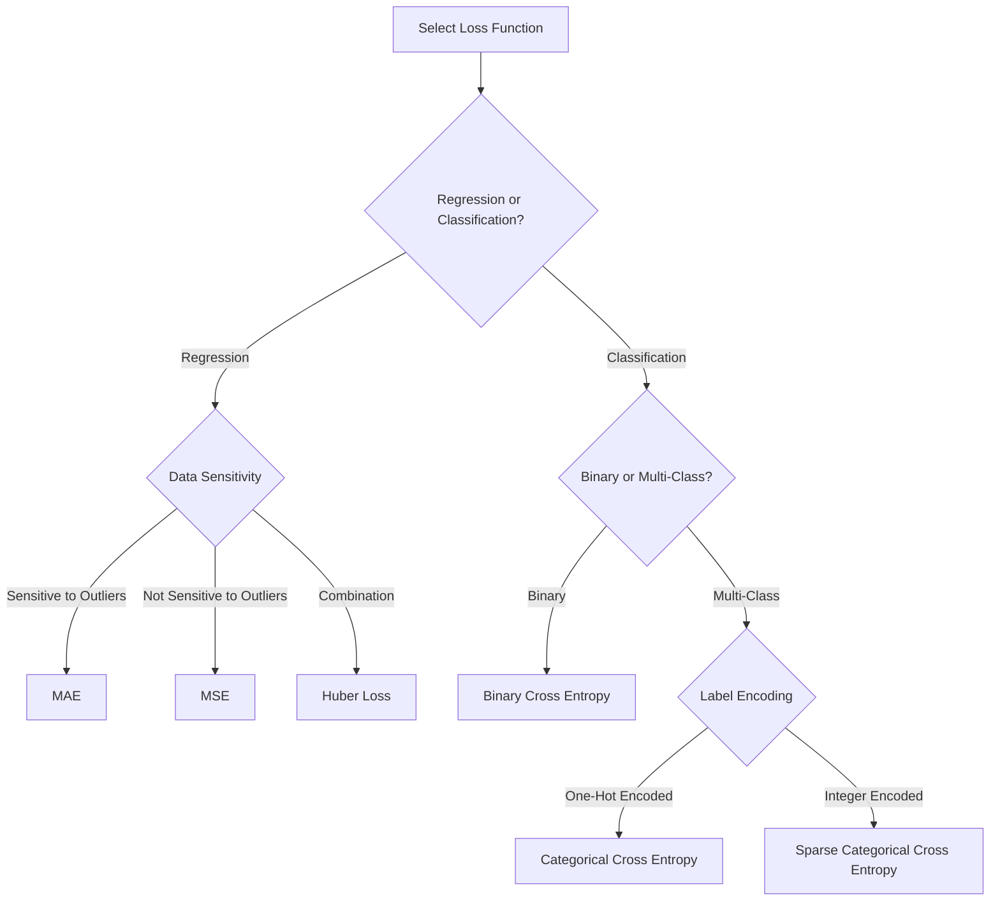

# Loss Functions in Deep Learning

Loss functions measure the difference between predicted outputs and actual target values in a neural network.
## When to Use Which Loss Function?

## 1. Mean Squared Error (MSE)

Equation:  

$$
\text{MSE} = \frac{1}{N} \sum_{i=1}^{N} (y_i - \hat{y}_i)^2
$$

Where \( y_i \) is the actual value, and \( \hat{y}_i \) is the predicted value.

| Advantages                                | Disadvantages                                     |
|------------------------------------------|--------------------------------------------------|
| Penalizes larger errors more than smaller ones | Sensitive to outliers                             |
| Suitable for regression problems         | Not robust to noisy data                          |

## 2. Mean Absolute Error (MAE)

Equation:

$$
\text{MAE} = \frac{1}{N} \sum_{i=1}^{N} |y_i - \hat{y}_i|
$$

| Advantages                                | Disadvantages                                     |
|------------------------------------------|--------------------------------------------------|
| Robust to outliers                       | Doesn't penalize large errors as heavily as MSE   |
| Easier to interpret                      | Can lead to slower convergence during training    |

## 3. Huber Loss

Equation: 

$$
\text{Huber Loss} = 
\begin{cases} 
0.5 (y_i - \hat{y}_i)^2 & \text{if } |y_i - \hat{y}_i| \leq \delta \\
\delta (|y_i - \hat{y}_i| - 0.5 \delta) & \text{otherwise} 
\end{cases}
$$
### simple intuition:
 if, loss function value <= delta ; use MSE (mean square error)
	      otherwise, use MAE, (mean absolute errror)
| Advantages                                | Disadvantages                                     |
|------------------------------------------|--------------------------------------------------|
| Combines the best of MSE and MAE         | Requires tuning the hyperparameter \( \delta \)   |
| Less sensitive to outliers               | Slightly more complex to implement                |

## 4. Binary Cross Entropy
Measures the difference between predicted probabilities and actual binary labels. It is used for binary classification tasks, where the target output is either 0 or 1.
Equation: 

$$
\text{Binary Cross Entropy} = -\frac{1}{N} \sum_{i=1}^{N} \left[ y_i \log(\hat{y}_i) + (1-y_i) \log(1-\hat{y}_i) \right]
$$

| Advantages                                | Disadvantages                                     |
|------------------------------------------|--------------------------------------------------|
| Suitable for binary classification       | Assumes that predictions are independent          |
| Encourages probabilities to be close to 0 or 1 | Can be affected by class imbalance                |

## 5. Categorical Cross Entropy
Calculates the difference between predicted probability distributions and actual one-hot encoded labels in multi-class classification problems, where there are ***more than two classes.***
Equation:

$$
\text{Categorical Cross Entropy} = -\sum_{i=1}^{N} \sum_{j=1}^{C} y_{ij} \log(\hat{y}_{ij})
$$

Where \( C \) is the number of classes.

| Advantages                                | Disadvantages                                     |
|------------------------------------------|--------------------------------------------------|
| Suitable for multi-class classification  | Assumes one-hot encoded labels                    |
| Encourages higher confidence in correct predictions | Not suitable for sparse data                      |

## 6. Sparse Categorical Cross Entropy

Equation:  
Same as categorical cross entropy, but labels are integer encoded instead of one-hot encoded.

| Advantages                                | Disadvantages                                     |
|------------------------------------------|--------------------------------------------------|
| Suitable for large output spaces         | Limited to classification tasks with integer labels|
| More memory-efficient than categorical cross entropy | Same limitations as categorical cross entropy     |

