# Ensemble Learning

## What is Ensemble Learning?
Ensemble learning is a machine learning technique where multiple models are combined to solve a particular problem. The collective performance of these models often exceeds that of any single model, leveraging the "wisdom of the crowd" approach.

## Wisdom of the Crowd
The "wisdom of the crowd" concept suggests that aggregating multiple opinions or predictions tends to yield better results than relying on a single source. 
## why to use ensemble learning:

## Types of Ensemble Learning

### Diagram Explanation
Below is a diagram illustrating the four main types of ensemble learning techniques, showing whether they use the *same algorithm with different training datasets*, or *different algorithms*.

```mermaid
flowchart TD
    A[Ensemble Learning] --> B(Bagging)
    A --> C(Boosting)
    A --> D(Stacking)
    A --> E(Voting Ensemble)
    
    subgraph "**Same Algorithm, Different Training Data**" 
        style B fill:#000000,stroke:#1e3a8a,stroke-width:2px
        style C fill:#000000,stroke:#1e3a8a,stroke-width:2px
        B
        C
    end
    
    subgraph "**Different Algorithms**" 
        style D fill:#000000,stroke:#b56800,stroke-width:2px
        style E fill:#000000,stroke:#b56800,stroke-width:2px
        D
        E
    end

    B --> |Bootstrap Sampling| F{Multiple Training Datasets}
    C --> |Sequential Training| F
    D --> |Base Models| G{Different Algorithms}
    E --> |Voting| G

    B --> H[Random Forest]
    B --> I[Bagged Decision Trees]
    C --> J[AdaBoost]
    C --> K[Gradient Boosting]
    C --> L[XGBoost]
    C --> M[LightGBM]
    C --> N[CatBoost]
    D --> O[Custom Meta-Model]
    E --> P[Hard and Soft Voting]
    
    style H fill:#000000,stroke:#005f00,stroke-width:2px
    style I fill:#000000,stroke:#005f00,stroke-width:2px
    style J fill:#000000,stroke:#a00000,stroke-width:2px
    style K fill:#000000,stroke:#a00000,stroke-width:2px
    style L fill:#000000,stroke:#a00000,stroke-width:2px
    style M fill:#000000,stroke:#a00000,stroke-width:2px
    style N fill:#000000,stroke:#a00000,stroke-width:2px
    style O fill:#000000,stroke:#0f4c75,stroke-width:2px
    style P fill:#000000,stroke:#0f4c75,stroke-width:2px

```

## 1. Bagging
- **Concept**: Combines multiple models trained on different subsets of data.
- **Key Technique**: Bootstrap sampling.
- **Example Algorithms**:
  - **Random Forest**: An ensemble of decision trees.
  - **Bagged Decision Trees**: Aggregates predictions from multiple decision trees.

## 2. Boosting
- **Concept**: Sequentially trains models, with each new model focusing on errors from the previous one.
- **Key Technique**: Weighted combination of models.
- **Example Algorithms**:
  - **AdaBoost**: Adjusts weights based on misclassification.
  - **Gradient Boosting**: Optimizes the loss function through gradient descent.
  - **XGBoost**: An efficient implementation of gradient boosting with regularization.
  - **LightGBM**: Gradient boosting framework that uses tree-based learning.
  - **CatBoost**: Handles categorical features efficiently.

## 3. Stacking
- **Concept**: Combines multiple models (base learners) by training a meta-model on their predictions.
- **Key Technique**: Use of a second-level model to improve predictions.
- **Example Use**: Often involves diverse algorithms to leverage their strengths.

## 4. Voting Ensemble
- **Concept**: Aggregates predictions from multiple models (can be homogeneous or heterogeneous).
- **Types**:
  - **Hard Voting**: Takes the majority vote from predictions.
  - **Soft Voting**: Averages predicted probabilities from all models.
- **Example Use**: Combines different algorithms or models for better performance.

## Why Ensemble Learning Works
- **Diversity**: Combines different models to capture various patterns.
- **Reduction of Overfitting**: Mitigates the risk of overfitting individual models.
- **Improved Accuracy**: Enhances predictive performance through aggregation.

