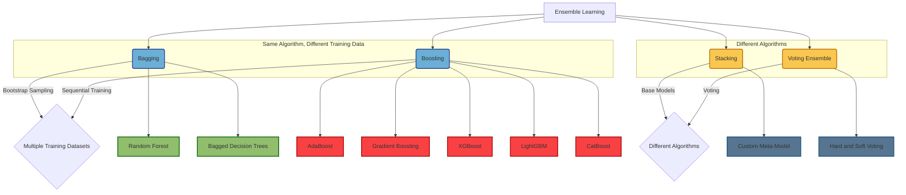

# Ensemble Learning

## What is Ensemble Learning?
Ensemble learning is a machine learning technique where multiple models, also known as "weak learners," are combined to solve a particular problem. The collective performance of these models often exceeds that of any single model, leveraging the "wisdom of the crowd" approach.

## Wisdom of the Crowd
The "wisdom of the crowd" concept suggests that aggregating multiple opinions or predictions tends to yield better results than relying on a single source. In machine learning, ensemble methods take advantage of this principle by combining the outputs of different models to achieve a more accurate and robust final prediction.

## Types of Ensemble Learning

### Diagram Explanation
Below is a diagram illustrating the four main types of ensemble learning techniques, showing whether they use the same algorithm with different training datasets, or different algorithms.

