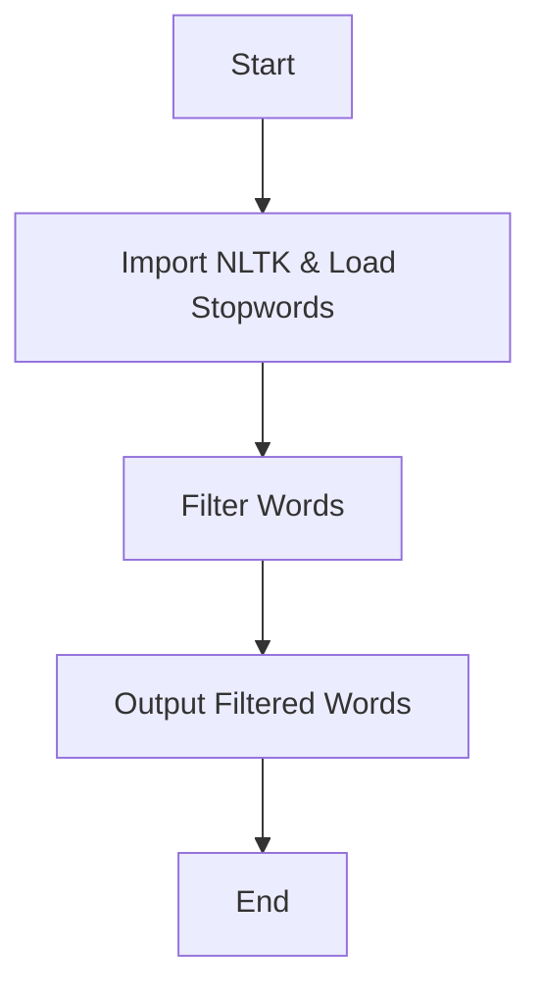

# Stopwords with NLTK

## What are Stopwords?
Commonly used words (e.g., "the", "is") often filtered out in NLP tasks.
## Flowchart

## Setup

1. **Install NLTK:**
```python
pip install nltk
import nltk
nltk.download('stopwords')
```
## import and load stop words
```python
from nltk.corpus import stopwords
stop_words = set(stopwords.words('english'))
```
### Filter stop words from a list
```python
words = ["the", "quick", "brown", "fox"]
filtered_words = [word for word in words if word.lower() not in stop_words]
```
## Example Output
Filtered: `['quick', 'brown', 'fox']`

# Parts of Speech Tags with NLTK

## Speech of Malala Yousafzai
> "One child, one teacher, one pen, and one book can change the world. Education is the only solution. Education is the only solution. Education is the only solution..."
###  Example Sentence
>**"Taj Mahal is a beautiful Monument."**

## Steps to Analyze Parts of Speech

1. **Import NLTK and Required Libraries**
```python
   import nltk
   from nltk.corpus import stopwords
   from nltk.tokenize import sent_tokenize, word_tokenize
```
**additional libraries**
```python
nltk.download('punkt')
nltk.download('averaged_perceptron_tagger')
nltk.download('stopwords')
```
2.  **Tokenize the Paragraph**
```python
paragraph = """One child, one teacher, one pen, and one book can change the world. Education is the only solution..."""
    sentences = nltk.sent_tokenize(paragraph)` 
```    
3.  **Filter Stopwords and Tag Parts of Speech**
    
```python
for sentence in sentences:
        words = nltk.word_tokenize(sentence)
        words = [word for word in words if word not in set(stopwords.words('english'))]
        pos_tag = nltk.pos_tag(words)
        print(pos_tag)
```
    

## Example Output for "Taj Mahal is a beautiful Monument."

```python
print(nltk.pos_tag("Taj Mahal is a beautiful Monument.".split()))
```
##### Output: [('Taj', 'NNP'), ('Mahal', 'NNP'), ('is', 'VBZ'), ('a', 'DT'), ('beautiful', 'JJ'), ('Monument', 'NN')]` 

## Parts of Speech Key
# Parts of Speech Tags

| **Part of Speech** | **Tags** |
|---------------------|----------|
| **1. Noun**        | - **NN**: Noun, singular (e.g., "book")<br>- **NNS**: Noun, plural (e.g., "books")<br>- **NNP**: Proper noun, singular (e.g., "Taj Mahal") |
| **2. Pronoun**     | - **PRP**: Personal pronoun (e.g., "he", "she", "it")<br>- **PRP$**: Possessive pronoun (e.g., "his", "her") |
| **3. Verb**        | - **VB**: Verb, base form (e.g., "run")<br>- **VBD**: Verb, past tense (e.g., "ran")<br>- **VBG**: Verb, gerund or present participle (e.g., "running")<br>- **VBP**: Verb, non-3rd person singular present (e.g., "run")<br>- **VBZ**: Verb, 3rd person singular present (e.g., "runs") |
| **4. Adjective**   | - **JJ**: Adjective (e.g., "beautiful") |
| **5. Adverb**      | - **RB**: Adverb (e.g., "quickly") |
| **6. Determiner**  | - **DT**: Determiner (e.g., "the", "a") |
| **7. Preposition**  | - **IN**: Preposition (e.g., "in", "on", "at") |
| **8. Conjunction** | - **CC**: Coordinating conjunction (e.g., "and", "but") |
| **9. Interjection** | - **UH**: Interjection (e.g., "wow!", "ouch!") |
---


