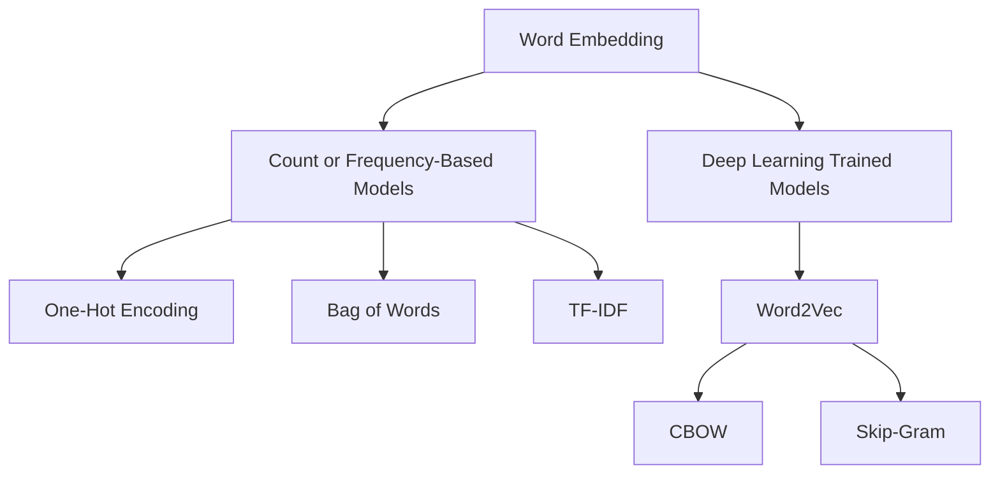

# Word Embedding

Word embedding is a technique used in Natural Language Processing (NLP) to represent words in a continuous vector space, capturing semantic meanings and relationships.

## Types of Word Embedding

### 1. Count or Frequency-Based Models
These models create word embeddings based on the frequency of words in a text corpus.

- **1.1 One-Hot Encoding**
  - Represents each word as a binary vector.
  - The size of the vector is equal to the vocabulary size.
  - Each word is marked with a '1' at its index and '0's elsewhere.

- **1.2 Bag of Words**
  - Represents the presence or absence of words in a document.
  - Ignores the order of words and considers only their frequency.

- **1.3 TF-IDF (Term Frequency-Inverse Document Frequency)**
  - Evaluates the importance of a word in a document relative to a collection of documents (corpus).
  
  **Formula**:

### 2. Deep Learning Trained Models
These models create word embeddings using neural networks and learn word representations from large amounts of text data.

- **2.1 Word2Vec**
  - A neural network-based approach to generating word embeddings.
  - Two main architectures:
    - **Continuous Bag of Words (CBOW)**
      - Predicts a target word based on its context words.
      - Takes surrounding words as input to predict the central word.

    - **Skip-Gram**
      - Predicts context words based on a target word.
      - Takes a central word as input to predict surrounding words.

